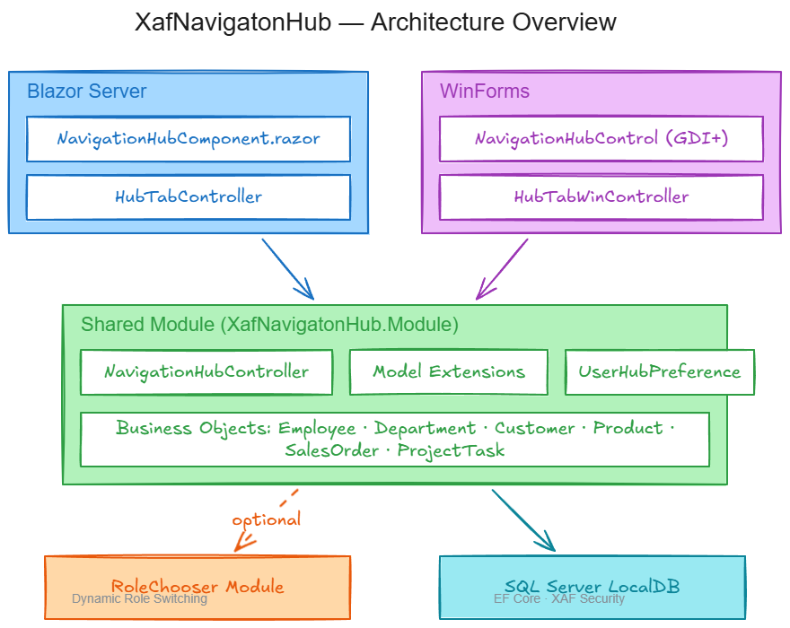

# XafNavigationHub



A **Navigation Hub / Launchpad** for DevExpress XAF that replaces sidebar navigation with a card-based dashboard. Users land on a styled home screen with categorized button tiles that open different functional areas. Supports both Blazor Server and WinForms frontends.

## Features

- **Card-based navigation** — colorful tiles with icons, grouped by category
- **Per-user pinned favorites** — right-click to pin, click "x" or right-click to unpin from "Preferred Actions" row, persisted in database
- **Drag & drop** (Blazor) — drag cards into favorites, reorder pinned items, drop to unpin
- **Role-based visibility** — buttons automatically hidden based on XAF navigation permissions
- **External URL buttons** — open external links in a new browser tab
- **Dark theme support** — adapts to active skin/palette on both platforms
- **Non-closable hub tab** — hub tab stays open in TabbedMDI on both platforms
- **Model-driven configuration** — hub layout defined in XAF Application Model (no code changes needed to add/remove buttons)
- **RoleChooser integration** (`rolechooser` branch) — optional [XafRoleChooser](https://github.com/MBrekhof/XafRoleChooser) module lets users switch active roles at runtime, dynamically showing/hiding hub cards

## Prerequisites

- .NET 8 SDK
- DevExpress v25.2.3 NuGet feed configured
- SQL Server LocalDB (included with Visual Studio)

## Getting Started

1. Clone the repository
2. Ensure your DevExpress NuGet feed is configured
3. Build the solution:
   ```bash
   dotnet build XafNavigationHub.slnx
   ```
4. Run the Blazor Server app:
   ```bash
   dotnet run --project XafNavigationHub/XafNavigationHub.Blazor.Server
   ```
   Or the WinForms app:
   ```bash
   dotnet run --project XafNavigationHub/XafNavigationHub.Win
   ```
5. Log in with one of the demo accounts (empty passwords in Debug mode):
   - **Admin** — full access (all roles: Administrators, HR, Sales)
   - **HrManager** — HR + Sales access (can toggle roles with RoleChooser)
   - **SalesRep** — sales and CRM access
   - **User** — basic access (Default role only)

## Project Structure

| Project | Description |
|---------|-------------|
| `XafNavigationHub.Module` | Shared module: business objects, controllers, model extensions, database updater |
| `XafNavigationHub.Blazor.Server` | Blazor Server frontend with Razor component hub |
| `XafNavigationHub.Win` | WinForms frontend with owner-draw painted hub |

## How It Works

The hub is registered as a `DashboardView` with a `ControlDetailItem` pointing to a platform-specific control:

- **Blazor**: `NavigationHubComponent.razor` — self-contained Razor component with HTML5 drag & drop
- **WinForms**: `NavigationHubControl` — `XtraUserControl` with GDI+ owner-draw painting

Hub buttons are defined in the XAF Application Model (`Model.DesignedDiffs.xafml`) under a `NavigationHub` node. Each button references an XAF navigation item by ID and is filtered at runtime based on the user's permissions.

User favorites are stored in `UserHubPreference` (per-user, per-button, with sort order).

## Demo Data

The project includes demo business objects (Employee, Department, Customer, Product, SalesOrder, ProjectTask, AuditLogEntry) with seed data and roles to demonstrate role-based hub filtering.

## Database

Uses SQL Server LocalDB. XAF creates and updates the database automatically on first run. Default connection string: `(localdb)\mssqllocaldb`, catalog `XafNavigationHub`.

## Configuration

See [HOW_TO_IMPLEMENT.md](HOW_TO_IMPLEMENT.md) for details on adding buttons, categories, and customizing the hub.
